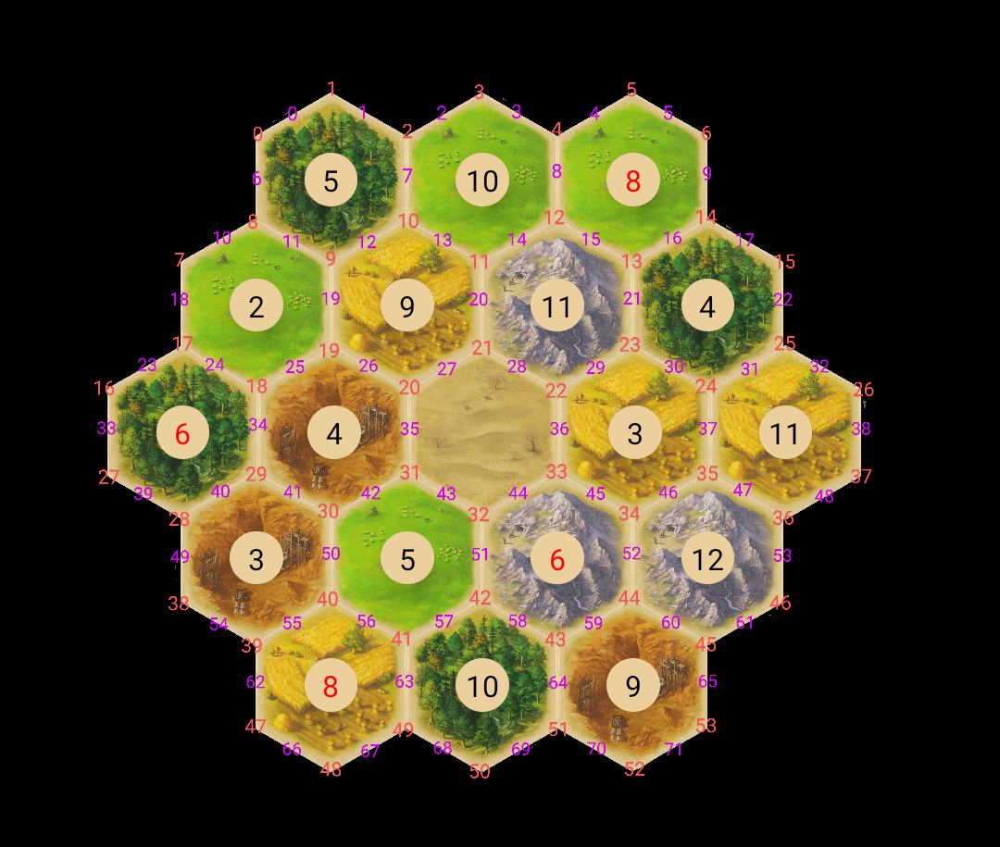

ID - 208768978
Email - michibinyamin@gmail.com

objects :

- catan
- board
- player
- tile
- position (where we put settelments)
- path (where we put roads)
- card
- development card (card) פיתוח
- resources card (card) משאב
- monopoly card (card)

- night
- victory point
- build two roards
- monopoly, take a card from everyone

how will a player choose a road\settelment positions :
- settalment - a number representing the position on the board
- road - a number representing the road on the board

Catan : 
- 3 players
- board

Tile :
- land (desert, forest, hills, pasture, mountains, fields)
- number (0 - no number, 2,3,4,5,6,8,9,10,11,12)

Path : 
- number representing on board (int)
- owner - indicates to who this path belongs (0 - belongs to no one)
- two positions, the vertecies in both sides of the path (Position)

Position : (a class which represents a vertex on the graph)
- number representing on board (int)
- owner - indicates to who this vertex belongs (0 - belongs to no one)
- 3 tiles   (Tile)
- 3 roads(which road belongs to who)    (int)
- 3 neighbors(linked together)  (position)

board :
- a list of positions   (54)
- a list of paths       (72)
- a list of tiles       (19)
- init method which initializes the board accourding to a list of tiles that it gets

player :
- instance of the board

